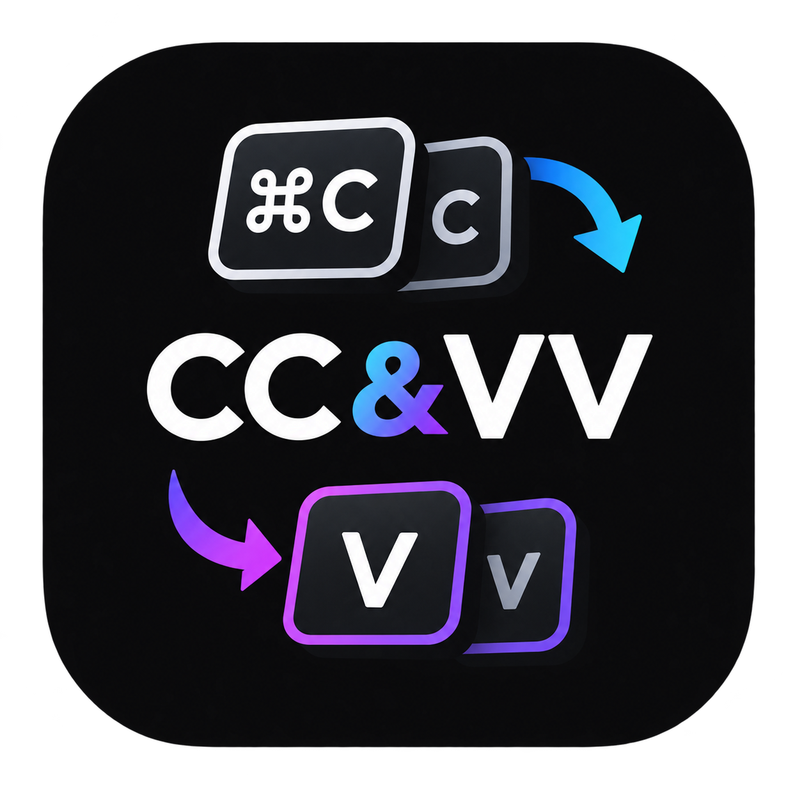
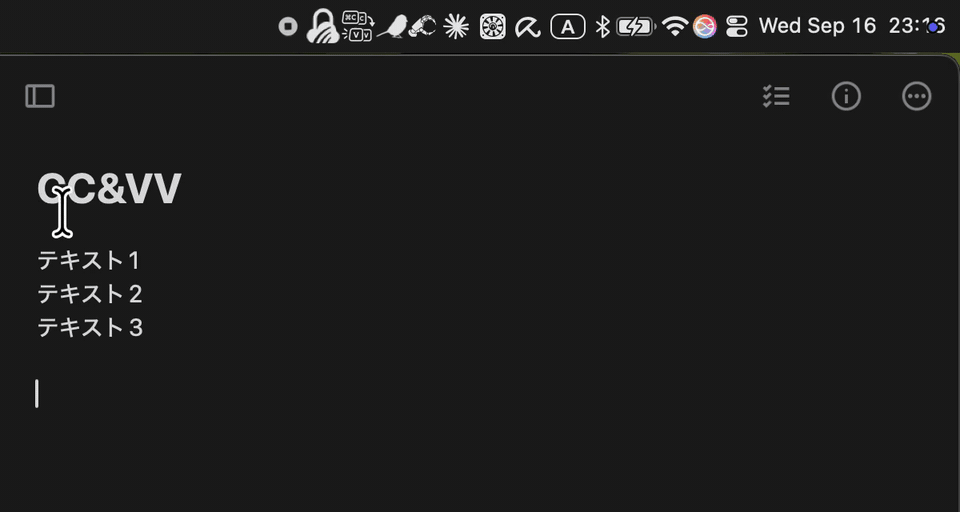

<p align="center">
  
</p>

# CC&VV

あるページから別のページにテキストをコピー&ペーストするとき、2つコピーできればいいのに！と思ったことはありませんか？
このアプリはそのためのアプリです！

`Cmd+C` / `Cmd+V` の**連続押し**で複数のコピー・スロットを同時に使用できる、メニューバー常駐の macOS ユーティリティです。



**📥 ダウンロード: [Latest Release](https://github.com/nicokinu/ccvv/releases/latest)**

> 自己署名のため、ダウンロード後は**初回だけ右クリック→「開く」**で起動してください。
> 起動後、システム設定 > プライバシーとセキュリティ > アクセシビリティ で「CC&VV」を許可してください。

| 操作 | 挙動 |
| --- | --- |
| `Cmd+C` ×1 | 通常コピー（スロット1 = システムのクリップボード） |
| `Cmd+C` ×2 | 選択中の内容を **スロット2** に保存 |
| `Cmd+C` ×3 | 選択中の内容を **スロット3** に保存 |
| `Cmd+C` ×4 | 選択中の内容を **スロット4** に保存 |
| `Cmd+V` ×1 | 通常ペースト |
| `Cmd+V` ×2 | **スロット2** の内容をペースト |
| `Cmd+V` ×3 | **スロット3** の内容をペースト |
| `Cmd+V` ×4 | **スロット4** の内容をペースト |


## 名前について

**CC&VV** はキー操作から取った名前です。

## 制限事項

1. このアプリを起動すると、ペーストの挙動が0.35秒遅れます。(VVが押されないか判定するため)
2. セキュリティのため、パスワードフィールドにはスロットからのペーストができません。パスワードだけは`Cmd+V` ×1 の通常ペーストを使ってください。

## ビルドと起動

```bash
./build.sh
open "build/CC&VV.app"
```

初回のみ、**システム設定 > プライバシーとセキュリティ > アクセシビリティ** で
「CC&VV」を許可してください（許可がないと起動時にダイアログが出ます）。
メニューバーに **CC/VV アイコン** が出たら起動成功です。

> `swiftc` が「Xcode license」で失敗する環境では、自動的に
> Command Line Tools 版のコンパイラを使ってビルドします。

### 再ビルド後に権限が外れたように見えるとき

ad-hoc 署名では**ビルドのたびにコード署名（cdhash）が変わる**ため、
TCC の記録と不一致を起こして「スイッチが ON なのに拒否される」ことが起きます。
その場合は:

```bash
pkill -x CCVV
tccutil reset Accessibility dev.nico.ccvv
open "build/CC&VV.app"   # 出てくるプロンプトで再度許可
```

※ `./certs.sh` で作成した自己署名証明書（"Copyman Code Signing"）で
署名されている限り、再ビルドでは権限は外れません。証明書名は
旧名のままですが、作り直すと TCC の照合が壊れるので触らないこと。

## 使い方（email / password の例）

1. メールアドレスをコピー → すかさずもう一度 `Cmd+C`（＝CC）→ スロット2に保存
2. パスワードをコピー（→ 通常のクリップボード＝スロット1に残る）
3. 入力欄で `Cmd+V` → パスワード、続けて `Cmd+VV` → メールをペースト
   （ペースト後、クリップボードはパスワードに戻ったまま）

メニューバー アイコンのメニューからは、各スロットの内容確認や
「クリックでクリップボードに読み込み」ができます。
また **「🗑 全スロットをクリア」** で、全スロットとクリップボードを
まとめて消去できます（パスワード等の残存防止）。

## アイコン

- `Resources/AppIcon.icns` … アプリアイコン（青グラデーションの
  角丸四角に CC / VV）
- `Resources/MenuBarIcon.pdf` … メニューバー用テンプレートアイコン

デザインを変えたいときは `tools/make-icon.swift` を編集して
`./make_icon.sh` を実行すると再生成されます。

## 設定

`Sources/main.swift` の先頭定数で調整できます。

| 定数 | デフォルト | 意味 |
| --- | --- | --- |
| `kMaxSlot` | `4` | 対応する最大スロット番号 |
| `kPressWindow` | `0.35` | 連続押しとみなす間隔（秒） |

スロットの内容は `~/.ccvv_slots.json` に永続化され、再起動後も残ります。

## インストール（ログイン時自動起動）

```bash
./install.sh     # /Applications に配置し、LaunchAgent で自動起動を有効化
./uninstall.sh   # アンインストール（スロットの内容は残る）
```

`install.sh` はビルド → `/Applications/CC&VV.app` へコピー →
`~/Library/LaunchAgents/dev.nico.ccvv.plist` 登録まで行います。
手動起動のみなら `open "build/CC&VV.app"` でも動きます。

## 仕組みと注意点

- 1回目の `Cmd+V` は「2回目が来るか」を `kPressWindow` 秒待つため、
  **通常のペーストも約0.35秒遅れて**実行されます。体感が合わなければ
  `kPressWindow` を調整してください。
- コピー（`CC`）は遅延なし。アプリ本来の `Cmd+C` は止めず、その後の
  クリップボード内容をスロットに記録する方式です。ペースト時だけ元の
  キー入力を抑止して、印を付けた `Cmd+V` をうち直しています。
- **スロット1はシステムクリップボードそのもの**なので、`Cmd+V` は（右クリック
  メニューからのコピーなど C キーを介さないコピー後も）常に通常どおり動きます。
- スロット2以降が空のときに `VV`/`VVV`/`VVVV` を押した場合は、何もペーストしません。
- **ブラウザのパスワード入力欄など「セキュア入力」が有効なフィールドでは、
  イベントタップがキー入力を検知できません。** その場面では `VV` が効かず
  通常の `V` がそのまま2回届きます。その場合はメニューからスロットを
  選んでから `Cmd+V` してください。
- スロットに保存できるのはテキストのみです（メール・パスワード用途前提）。
- スロットの保存ファイル `~/.ccvv_slots.json` は平文のため、権限を 600
  （自分のみ読み取り可）にしています。完全な消去はメニューバーの
  「🗑 全スロットをクリア」から。
- デバッグログは既定でオフ（`Sources/main.swift` の `kDebugLog = false`）。
  切り分けが必要なときだけ true にして再ビルドすると `~/.ccvv.log` に
  出ます（コピペ内容の一部がログに残る点に注意）。
